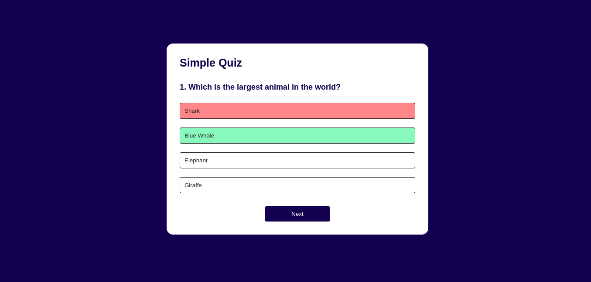
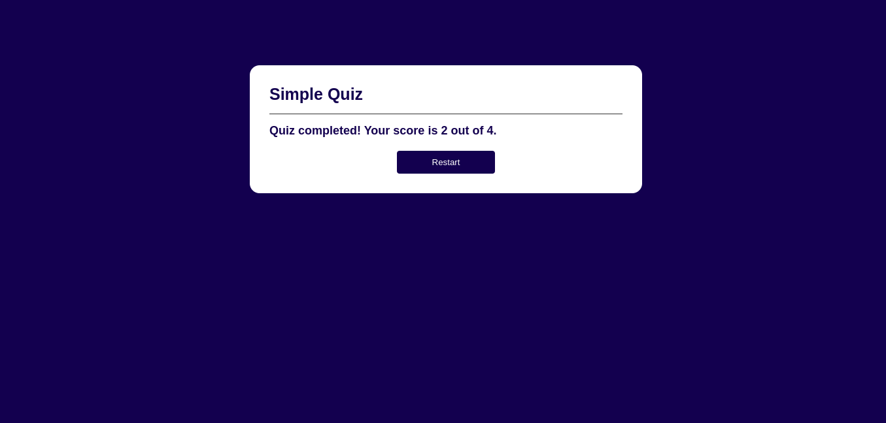

# Quiz App with HTML, CSS, and JavaScript

A simple and interactive quiz application built using **HTML**, **CSS**, and **JavaScript**. This app allows users to answer multiple-choice questions and shows their results.

## Features

- **Interactive UI**: Users can answer questions and see correct/incorrect responses.
- **Next Question Button**: After answering, users can proceed to the next question.
- **Responsive Design**: The app works well on both desktop and mobile devices.
- **Minimalistic Design**: Clean and modern layout for an optimal user experience.



This is the first image of the app.



This is the second image of the app.


## Technologies Used

- **HTML**: Structure of the web page.
- **CSS**: Styling and layout of the app.
- **JavaScript**: Functionality for the quiz logic.

## Installation

1. **Clone the repository** to your local machine:
   ```bash
   git clone https://github.com/mahmoor786/Quiz-App-With-HTML-CSS-and-JavaScript.git
   ```

2. **Navigate to the project directory**:
   ```bash
   cd Quiz-App-With-HTML-CSS-and-JavaScript
   ```

3. **Open the `index.html` file** in your browser:
   ```bash
   open index.html
   ```
   - Or, right-click and select **Open with** to open it in your browser.

## Usage

To use the quiz app:

1. **Open the `index.html` file** in any modern browser.
2. **Answer the questions** by clicking on the buttons.
3. After answering, the app will show whether your answer is correct or incorrect.
4. Click the **"Next"** button to move on to the next question.

## How to Contribute

1. Fork the repository.
2. Create a new branch (`git checkout -b feature-name`).
3. Make your changes and commit them (`git commit -m 'Added new feature'`).
4. Push to the branch (`git push origin feature-name`).
5. Open a pull request.


## How to Import the Project via Terminal

If you want to clone the project using the terminal:

1. Open your terminal or command prompt.
2. Run the following command to clone the repository:
   ```bash
   git clone https://github.com/mahmoor786/Quiz-App-With-HTML-CSS-and-JavaScript.git
   ```
3. Navigate to the project folder:
   ```bash
   cd Quiz-App-With-HTML-CSS-and-JavaScript
   ```
4. Open the `index.html` file in any browser to view and use the app.

## Credits

This repository contains projects that were inspired by tutorials I followed on YouTube. 

- **YouTube Tutorial**: [Link to the tutorial video](https://www.youtube.com/watch?v=PBcqGxrr9g8&t=1566s)  
  - I followed this tutorial to build a quiz app from scratch and then customized it for my learning.

Feel free to check the video for more details on how the project was created!
